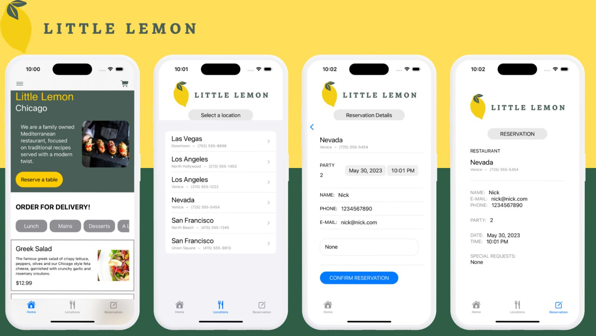

## Table of contents
* [General info](#general-info)
* [Framworks](#frameworks)
* [Features](#features)
* [Screenshots](#screenshots)
* [Acknowledgments](#acknowledgments)

## General info
This project is an app made for making reservations and see the different food types that Little Lemon restaurant can offer as well as the picture, description and the price

## Framworks
- SwiftUI

## Features
- Make a reservation.
- Simplicity to see the different meals.
- See what is the main kind of food the restaurant offer.
- The user can see their actual reservation status.

## Screenshots

## Acknowlegdments
- The design is inspired in the course "Principles of UX/UI Design" by Meta.
- The functionality was an excercise from the course "Create the UI with SwiftUI" by meta.
- I added some functionalities not required in the courses aformentioned.
